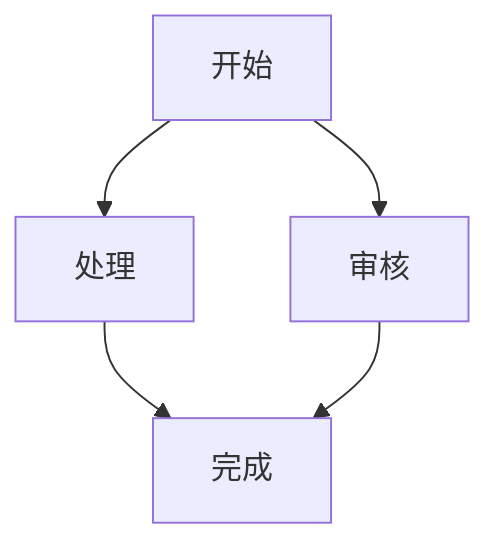
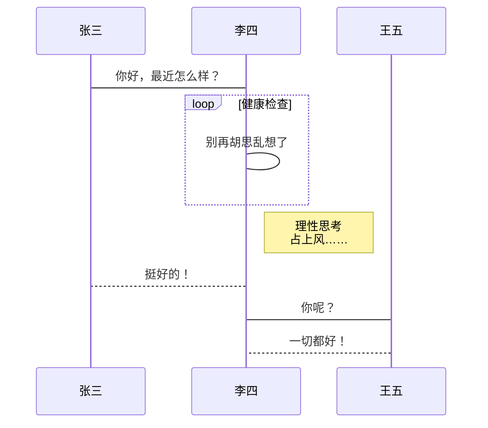
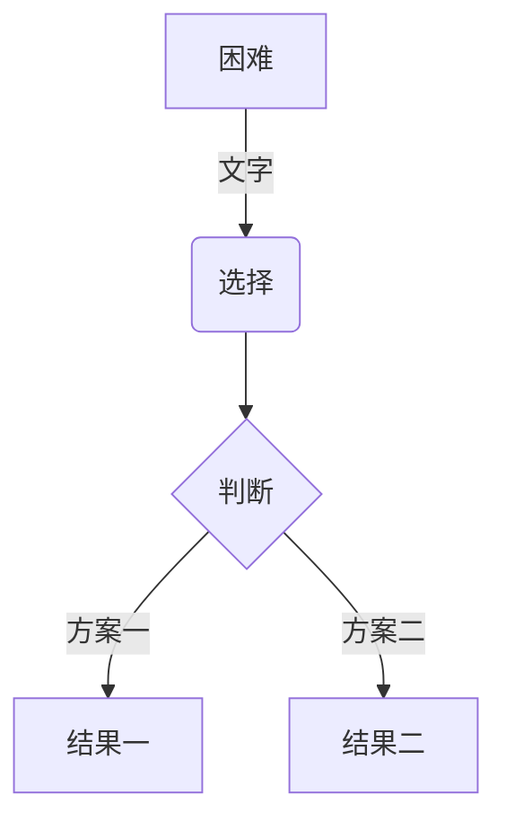
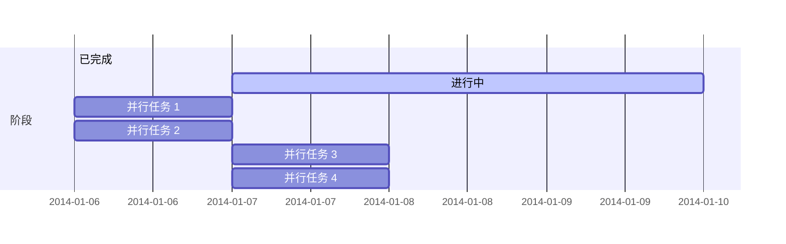
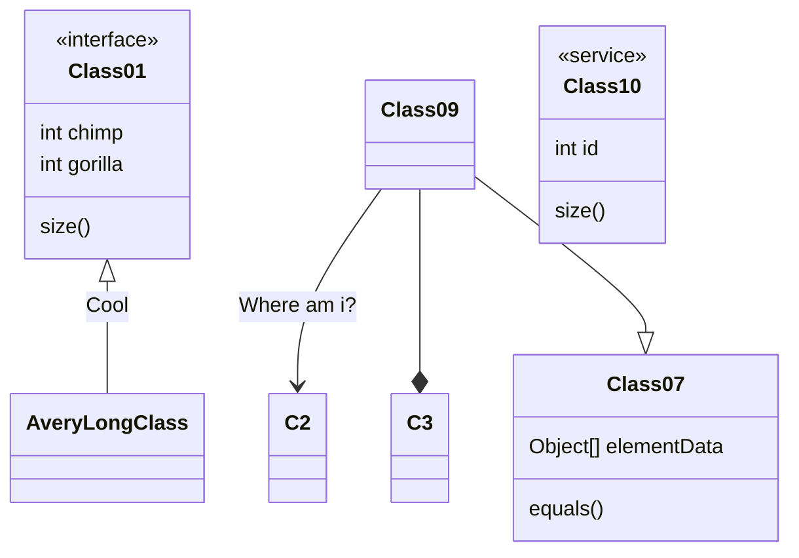
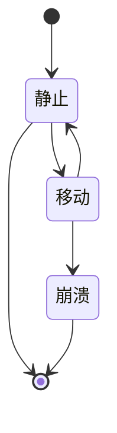
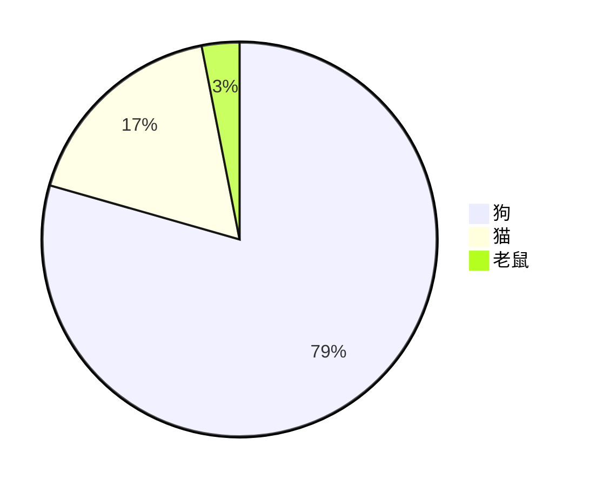

```mermaid
graph TD;
  A[开始]-->B[处理];
  A-->C[审核];
  B-->D[完成];
  C-->D;
```

```mermaid
sequenceDiagram
  participant 张三
  participant 李四
  张三->李四: 你好，最近怎么样？
  loop 健康检查
      李四->李四: 别再胡思乱想了
  end
  Note right of 李四: 理性思考<br/>占上风……
  李四-->张三: 挺好的！
  李四->王五: 你呢？
  王五-->李四: 一切都好！
```

```mermaid
graph TD
A[困难] -->|文字| B(选择)
B --> C{判断}
C -->|方案一| D[结果一]
C -->|方案二| E[结果二]
```

```mermaid
gantt
section 阶段
已完成     :done,    des1, 2014-01-06,2014-01-08
进行中     :active,  des2, 2014-01-07, 3d
并行任务 1 :         des3, after des1, 1d
并行任务 2 :         des4, after des1, 1d
并行任务 3 :         des5, after des3, 1d
并行任务 4 :         des6, after des4, 1d
```

```mermaid
classDiagram
Class01 <|-- AveryLongClass : Cool
<<interface>> Class01
Class09 --> C2 : Where am i?
Class09 --* C3
Class09 --|> Class07
Class07 : equals()
Class07 : Object[] elementData
Class01 : size()
Class01 : int chimp
Class01 : int gorilla
class Class10 {
  <<service>>
  int id
  size()
}
```

```mermaid
stateDiagram
[*] --> 静止
静止 --> [*]
静止 --> 移动
移动 --> 静止
移动 --> 崩溃
崩溃 --> [*]
```

```mermaid
pie
"狗" : 386
"猫" : 85
"老鼠" : 15
```
